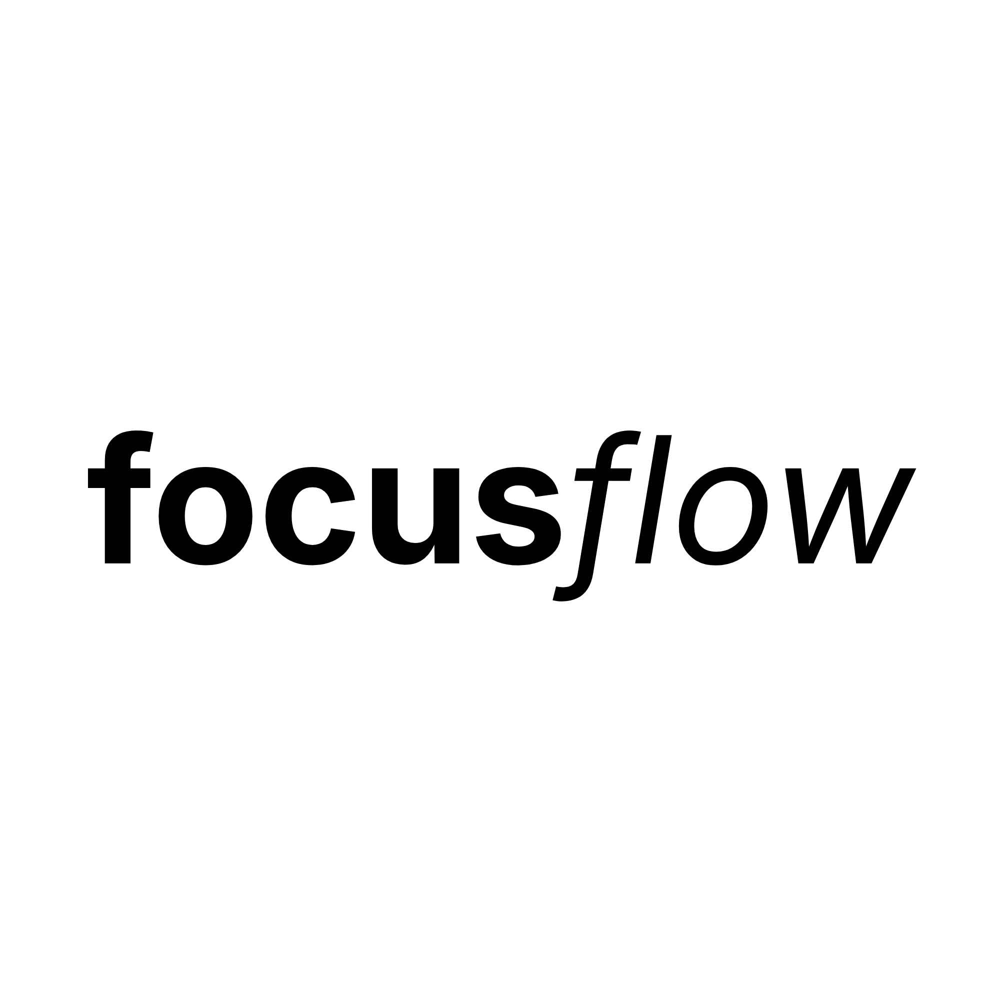

# SydTrack



SydTrack is a local-first Windows productivity tracker that watches your active window, classifies time as productive, unproductive, or other, and helps you understand where your day went.


## Features

- **Local active-window tracking:** records foreground applications on Windows.
- **Productive by default for browsers:** Chrome, Edge, Firefox, Brave, Opera, and Chromium are productive when no keyword matches.
- **Keyword overrides:** unproductive keywords such as YouTube take priority over the browser default.
- **Separate app categories:** the same app can appear in both productive and unproductive analytics with separate time totals.
- **Home:** mood, time pie, last-focused app, FocusBoost, and quick productive/unproductive/ignore actions.
- **Analytics:** day, week, month, hourly, and app views.
- **Roundup:** daily goal progress, top focus, biggest distraction, peak hour, focus share, and a daily story.
- **Focus sessions:** Pomodoro, deep work, or custom timers with session history and distraction counts.
- **Focus Tags:** editable productive, unproductive, and ignore keywords.
- **FocusBoost:** shorter reminders for unproductive streaks, with optional schedules.
- **Portable data:** local `.sydtrack` backups and `.sydtrack-profile` focus-tag packs.
- **Tray operation:** keeps tracking quietly while the main window is hidden.

## Privacy

SydTrack is fully local. It does not require an account and does not upload activity to a server. Local data can include application names, window titles, and URLs captured from active browser windows, so treat exported backup files as private records.


### Usage

Requirements:

- Windows 10 or Windows 11, x64
- Node.js 18 or newer
- PowerShell available for the Windows foreground-window backend

From the project directory:

```powershell
npm install
npm start
```

Optional demo mode:

```powershell
npm run start:demo
```

Run the smoke tests:

```powershell
npm test
```


## Classification

Classification checks process names, window titles, URLs, and configured keywords.

1. Ignored processes are excluded from tracking.
2. Unproductive keyword matches take priority.
3. Productive keyword matches are applied next.
4. Recognized browsers with no matching keyword default to productive.
5. Unknown applications without a match are other.

Browser activity is stored by category, so switching from a productive GitHub tab to an unproductive YouTube tab does not reclassify the earlier time.

## Data

During development, SydTrack stores local data under `data/`. Packaged builds use Electron's user data directory. Data includes daily statistics, hourly buckets, history, settings, and focus sessions.

Settings can export:

- `.sydtrack` history backups, optionally including settings, rules, and ignore lists.
- `.sydtrack-profile` files containing portable focus tags only.

## Project Status

SydTrack is an actively developed Windows desktop application. Browser tracking is intentionally rudimentary: it uses the active browser window title and URL rather than browser extensions or tab APIs. This keeps the application local and lightweight while leaving room for deeper browser integration later.

[](https://gnu.org
