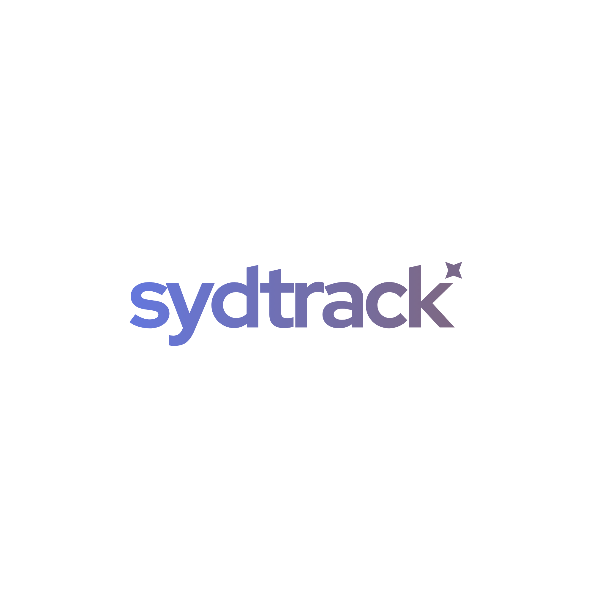

<div align="center">
  
  <br><br>
<video src="https://github.com/user-attachments/assets/ff96b86b-1c90-4d81-b8c4-27b4ca297569" width="100%" autoplay loop muted playsinline style="pointer-events: none;"></video>

SydTrack is a local-first Windows productivity tracker that watches your active window, classifies time as productive, unproductive, or other, and helps you understand where your day went.


## Features

- **Local active-window tracking:** records foreground applications on Windows.
- **Browser-independent title tracking:** recognized browsers, apps named Browser, and configured browser identities are productive when no title keyword matches. No browser extension is needed.
- **Keyword overrides:** unproductive keywords such as YouTube take priority over the browser default.
- **Portable website rules:** existing `site:example.com` tags are retained, but require a captured address. Normal Windows tracking currently uses title keywords; automatic address capture remains experimental and disabled.
- **Separate app categories:** the same app can appear in both productive and unproductive analytics with separate time totals.
- **Home:** mood, time pie, last-focused app, FocusBoost, and quick productive/unproductive/ignore actions.
- **Analytics:** day, week, month, hourly, and app views.
- **Roundup:** daily goal progress, top focus, biggest distraction, peak hour, focus share, and a daily story.
- **Focus sessions:** Pomodoro, deep work, or custom timers with session history and distraction counts.
- **Focus Tags:** editable productive, unproductive, and ignore keywords.
- **Live tag search:** reflects current editor drafts immediately, including unsaved additions and removals; quick-add moves a tag between lists.
- **FocusBoost:** shorter reminders for unproductive streaks, with optional schedules.
- **Portable data:** local `.sydtrack` backups and `.sydtrack-profile` focus-tag packs.
- **Tray operation:** keeps tracking quietly while the main window is hidden.
- **Consistent layout:** collapsed sidebar controls share a center line; narrow windows retain horizontal navigation, and custom-session minutes align with the Start button.

## Privacy

SydTrack is fully local. It does not require an account and does not upload activity to a server. Local data can include application names, window titles, and URLs captured from active browser windows, so treat exported backup files as private records.


### Usage

Requirements:

- Windows 10 or Windows 11, x64
- Node.js 18 or newer
- PowerShell available for the Windows foreground-window backend

From the project directory:

```powershell
npm install
npm start
```

Optional demo mode:

```powershell
npm run start:demo
```

Run the smoke tests:

```powershell
npm test
```

Optional isolated Electron UI checks (no tracking or access to your activity data):

```powershell
npm run test:ui
```


## Classification

Classification checks process names, window titles, URLs, and configured keywords.

1. Ignored process identities are excluded from tracking.
2. For non-browser apps, an explicit unproductive process-name tag wins; otherwise productive process identities take precedence over window titles and URLs.
3. For browsers with a captured address, `site:` tags take precedence over keywords. The most specific matching domain wins; the same domain in both lists is unproductive. For example, productive `site:learn.youtube.com` overrides unproductive `site:youtube.com` on that subdomain only. Rules match domain boundaries, never a domain mentioned in a page title or URL path.
4. Unproductive keyword matches take priority over ordinary productive keywords.
5. Productive keyword matches are applied next.
6. Recognized browsers with no matching keyword default to productive.
7. Unknown applications without a match are other.

Add website tags to the existing Productive or Unproductive lists (one per line). Use a domain without a path or wildcard, such as `site:youtube.com`. Ignore still applies to whole applications. Website tags travel with existing backups and profile packs; no data migration is needed. Older app versions preserve these strings but do not interpret them as website rules.

Normal Windows tracking reads the foreground application and window title. For browsers, add title keywords such as `youtube` or `github` in Focus Tags. It makes no address-bar query and does not read typed but unsubmitted addresses. This works independently of browser engine, provided the browser exposes a meaningful foreground title. Pages with vague or missing titles cannot be classified reliably from their website; they use the existing productive browser default unless a keyword matches.

Recognition includes Chrome, Firefox and other named browsers, an executable named `Browser.exe`, and application names ending in a separate `Browser` word. Add an unfamiliar executable name to `browserApps` in your app-data `app-identities.json`, then restart. Existing identity files without this optional array continue to work. Main tracking and the UI share the same recognition rules. A document title mentioning "browser" does not turn its native application into a browser.

The address-bar prototype remains disabled in production: live Chrome testing exposed unsubmitted-address capture and an unreliable focus guard. It can only be enabled explicitly by a developer through the backend factory for testing. Existing `site:` rules and profile packs remain readable, but these rules do not match ordinary title-only Windows samples. Do not rely on them instead of title keywords yet. No stored history is rewritten when this capture behavior changes.

`app-identities.json` contains the configurable process/app identities. On first run SydTrack copies it to its app-data folder, where it can be customized without editing the installed app (restart after editing). Identities match exact process names or executable basenames, with or without `.exe`. Browser identities never override content classification. Invalid JSON falls back to bundled identities while preserving the custom file.

Browser activity is stored by category, so switching from a productive GitHub tab to an unproductive YouTube tab does not reclassify the earlier time.

Idle tracking pauses at the configured timeout and retains time earned before that timeout. Paused or idle ticks do not add session distractions. Sessions that expire while the app is closed finish at their original deadline.

Pause takes effect even while a foreground-window check is pending. Reading the session timer from the tray or UI does not consume its completion event, and tray settings changes do not replay completed events.

## Data

During development, SydTrack stores local data under `data/`. Packaged builds use Electron's user data directory. Data includes daily statistics, hourly buckets, history, settings, and focus sessions.

Settings can export:

- `.sydtrack` history backups, optionally including settings, rules, and ignore lists.
- `.sydtrack-profile` files containing portable focus tags only.

Backup merge is additive: importing the same backup again adds its time again. Imports validate day data before replacing history and preserve hourly app/category breakdowns. Backups currently exclude sessions and custom app identities; copy those separately when moving all configuration. Daily statistics, settings, and session writes replace complete JSON files to reduce the risk of truncation. Malformed stored statistics are preserved and reported rather than silently reset.

Imported settings apply the same behavior as Settings controls. In particular, importing **Keep session history: off** retains only the latest local session. That retained entry is saved successfully before older session files are removed.

## Project Status

SydTrack is an actively developed Windows desktop application. Default browser tracking uses foreground titles; automatic website detection is deferred pending reliable browser-independent validation. It remains focused on simple productivity totals and reminders, without a browsing-history dashboard or background-tab monitoring.

License: GPL v3
